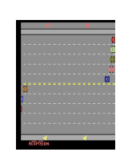
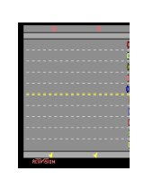

# Robust Deep Reinforcement Learning through Adversarial Loss

This repository contains Atari experiments of our NeurIPS 2021 paper [Robust Deep Reinforcement Learning through Adversarial Loss](https://arxiv.org/abs/2008.01976).

# Overview

**RADIAL**(**R**obust **AD**versar**IA**l **L**oss) - RL, is a framework for training more robust deep RL agents. It leverages algorithms for calculating certified output bounds such as Interval Bound Probagation to minimize an upper bound of the original algorithms loss function under worst possible (bounded) adversarial perturbation. This framework significantly increases neural net robustness against PGD-attacks. 

In addition we propose *Greedy Worst-Case Reward (GWC)*, an efficient method for estimating agents performance under worst possible sequence of adversarial attacks.

      

Trained DQN agents playing a game of Freeway, where the goal is to cross the road without hitting cars. From left to right
* DQN under no perturbation, reward 34.0
* DQN under 1/255 PGD-attack applied to each state input, reward 0.0. Standard agent fails against almost incerceptiple perturbations.
* RADIAL-DQN under 3/255 PGD-attack applied to each state input, reward 33.0. No performance drop against 3x larger attack.

Our code builds on top of various existing implementations, most notably:

* A3C implementation and overall flow based on https://github.com/dgriff777/rl_a3c_pytorch.
* DQN implementation based on https://github.com/higgsfield/RL-Adventure
* Adversarial attack implementations based on https://github.com/advboxes/AdvBox/blob/master/advbox.md.
* SA-DQN models and some training details are from https://github.com/chenhongge/SA_DQN

## Requirements
To run our code you need to have Python 3 (>=3.7) and pip installed on your systems. Additionally we require PyTorch>=1.4, which should be installed using instructions from https://pytorch.org/get-started/locally/.

To install requirements:

```setup
pip install -r requirements.txt
```

## Pre-trained Models

Pre-trained models are available at https://www.dropbox.com/sh/a3sck9hjc55afrs/AADN_DQsFqB8dwR7s1bQUz8aa?dl=0. Download A3C_models into 'A3C\trained_models' and DQN_models into 'DQN\trained_models'.

## Training

To train a standard A3C model on Pong like the one used on our paper, run this command:

```train A3C
cd A3C
python main.py 
```
By default uses GPU with id 0, can use multiple at the same time for example `--gpu-ids 0 1` or CPU `--gpu-ids -1`. Note the default value of workers used for A3C is 16, and you might want to change it to the amount of cpu cores in system for max efficiency with the argument `--workers 4` for example. This may effect results.

To train in another game, like RoadRunner use `--env RoadRunnerNoFrameskip-v4`. Other environments used in the paper are `FreewayNoFrameskip-v4 `and `BankHeistNoFrameskip-v4`. 

You can also train a standard DQN model with the following command, but to reproduce our paper results you should use the standard model from SA-DQN.
```train DQN
cd DQN
python main.py 
```
DQN can run on at most 1 GPU at a time. By default it uses the GPU with id 0. To change this use the following argument `--gpu-id x`(i.e. --gpu-id 1). Use `--gpu-id -1` to run on CPU.

The models will be saved in args.save_model_dir, with a name of their environment and time and date training started. Each run produces two models with \_last.pt saving the latest model, and \_best.pt saves the model scoring highest on the test metric used. 


## Robust training

To train a robust model on BankHeist like the one used in our paper use the following:

```Radial DQN
cd DQN
python main.py --env BankHeistNoFrameskip-v4 --robust --load-path "trained_models/BankHeist-natural_sadqn.pt" --total-frames 4500000 --exp-epsilon-decay 1
```


```Radial A3C
cd A3C
python main.py --env BankHeistNoFrameskip-v4 --robust --load-path "trained_models/BankHeist_a3c.pt" --total-frames 10000000
```
(Note: By default uses Approach #2, can change to Approach #1 with `--loss-fn approach_1`)


## Evaluation

To evaluate our robustly trained BankHeist model using the metrics described in the paper, use the following commands:

```
cd DQN
python evaluate.py --env BankHeistNoFrameskip-v4 --load-path "trained_models/BankHeist_radial_dqn.pt" --pgd --gwc --nominal --acr
```

```
cd A3C
python evaluate.py --env BankHeistNoFrameskip-v4 --load-path "trained_models/BankHeist_radial_a3c.pt" --pgd --gwc --nominal --acr
```
By default this uses GPU 0, to run on CPU use `--gpu-id -1`. Note that pgd takes much longer to run than other evaluation metrics, so you can try replacing it with much faster evaluation against FGSM attacks by switching the command to `--fgsm`.

Results will be saved in numpy arrays, and the result_viewer.ipynb provides a convenient way to view them.


### Training commands for models above
For DQN models make sure you are in the `radial_rl/DQN` directory before issuing commands, and in the `radial_rl/A3C` directory for A3C models. And have downloaded the pretrained models to specified directories.

| Game       | Model      |                                                                                          Command                                                                                          |
|------------|------------|:-----------------------------------------------------------------------------------------------------------------------------------------------------------------------------------------:|
|    Pong    | RADIAL-DQN |               python main.py --robust --load-path "trained_models/Pong-natural_sadqn.pt" --total-frames 4500000 --exp-epsilon-decay 1              |
|            | RADIAL-A3C |                                         python main.py --robust --load-path "trained_models/Pong_a3c.pt" --total-frames 10000000                                        |
|   Freeway  | RADIAL-DQN |    python main.py --env FreewayNoFrameskip-v4 --robust --load-path "trained_models/Freeway-natural_sadqn.pt" --total-frames 4500000 --exp-epsilon-decay 1    |
|  BankHeist | RADIAL-DQN |  python main.py --env BankHeistNoFrameskip-v4 --robust --load-path "trained_models/BankHeist-natural_sadqn.pt.pt" --total-frames 4500000 --exp-epsilon-decay 1  |
|            | RADIAL-A3C |                       python main.py --env BankHeistNoFrameskip-v4 --robust --load-path "trained_models/BankHeist_a3c.pt" --total-frames 10000000                       |
| RoadRunner | RADIAL-DQN | python main.py --env RoadRunnerNoFrameskip-v4 --robust --load-path "trained_models/RoadRunner-natural_sadqn.ptl" --total-frames 4500000 --exp-epsilon-decay 1 --exp-epsilon-end 0.01 --adam-eps 0.00015|
|            | RADIAL-A3C |                      python main.py --env RoadRunnerNoFrameskip-v4 --robust --load-path "trained_models/RoadRunner_a3c.pt" --total-frames 10000000 --kappa-end 0.8


## Common issues

On some machines you might get the following error ImportError: libSM.so.6: cannot open shared object file: No such file or directory,
which can be fixed by running the following line: 
```
sudo apt-get install libsm6 libxrender1 libfontconfig1
```
