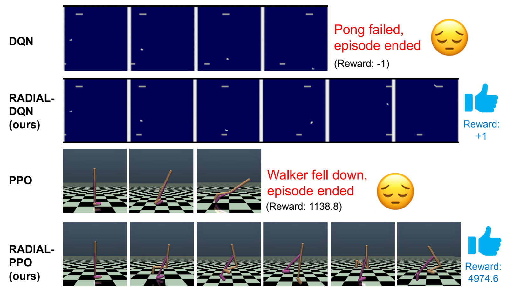

# Robust Adversarial Loss(RADIAL) - RL
This repository contains the official code and models used for our NeurIPS 2021 publication [Robust Deep Reinforcement Learning through Adversarial Loss](https://arxiv.org/abs/2008.01976). 

Our RADIAL models(row 2,4) reach good rewards under adversarial attacks to state input, unlike standard models (row 1,3). 

For code, model and installation instructions see the folders for each set of environments: "Atari", "Procgen" and "Mujoco".

An earlier version of our work is available at [github.com/tuomaso/radial_rl](github.com/tuomaso/radial_rl), which contains an earier implementation of Approach #1 for Atari DQN and A3C.
